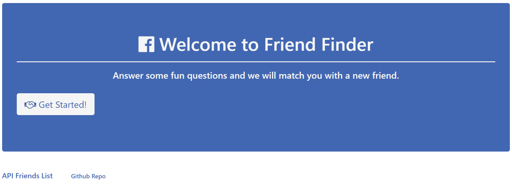
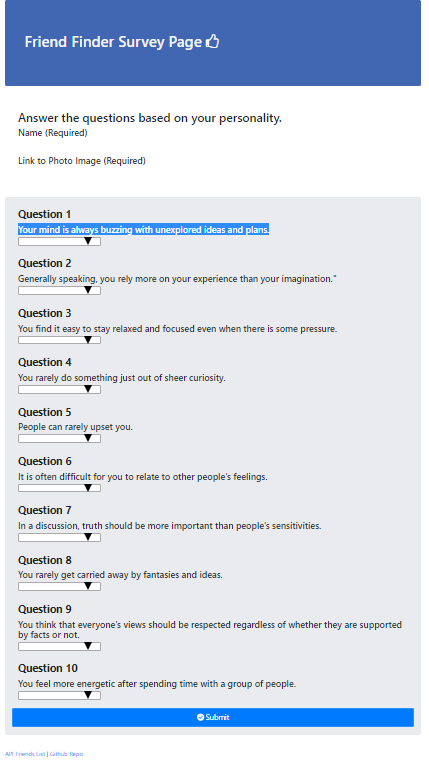
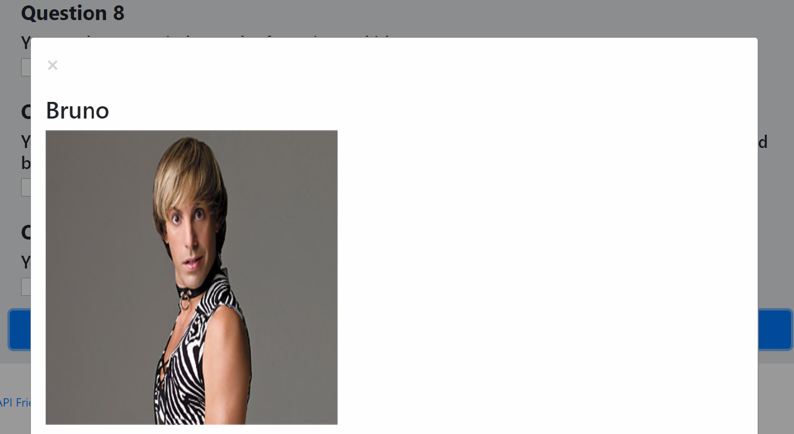

# FriendFinder

* This application is designed to help you find your match. It will take in results from users' surveys then compare their results against all other users who have completed it. The application will then display the name and picture of the user with the best match overall.

## Live Link

- https://jn-friend-finder.herokuapp.com/

## Technologies

- Node.js
- Modules: Express, body-parser, path
- jQuery
- Bootstrap


## Get Started

- Download
```
git clone https://github.com/raphatapi/FriendFinder.git

```

- Install Modules
```
$ npm install
```

- Initiate Server

```
$ node server.js   

```

## How it works

- Home Page 



- Answer survey 



- FriendFinder will then choose your best match 

